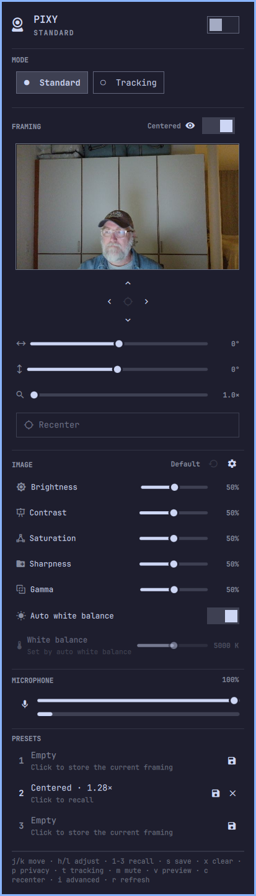
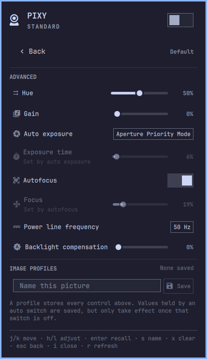
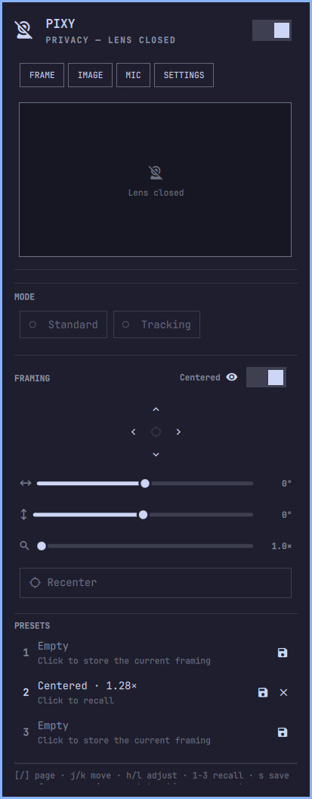

# EMEET PIXY for Omarchy

An EMEET PIXY webcam control panel for the Omarchy 4 bar.

Close the lens, switch AI tracking on or off, aim the camera, and recall framing presets — from a bar
widget that looks and behaves like the first-party ones.


| Everything at once | Behind the cog | Lens closed |
| --- | --- | --- |
|  |  |  |

## What it does

- **Privacy at a glance.** The bar glyph is a crossed-out webcam in the theme's alert color whenever
  the lens is closed, and right-click toggles it without opening anything — the one camera state with
  real consequences if you misread it. It is the panel's hero switch rather than a third mode chip for
  the same reason.
- **AI tracking.** Standard or Tracking, as a chip pair.
- **Pan, tilt, and zoom.** A jog pad for aiming by feel, plus sliders showing the actual angle, read
  back from the hardware — so the panel is right even after another app moved the camera. Three presets
  save and recall a framing.
- **A live preview, sized for framing.** A thumbnail above the jog pad, started when you open the panel
  and stopped when you close it or the lens, or for good from the FRAMING header.
- **Microphone, too.** Mute, volume, and a live level meter for the camera's own mic — on a call it is
  usually the mic in use, so muting it belongs next to closing the lens rather than two panels away.
- **Image controls that work during a call.** Brightness, contrast, saturation, sharpness, gamma and
  white balance in the panel, with hue, gain, exposure, focus and the rest behind a cog, and named
  profiles recalling every control at once. They go over UVC control ioctls rather than the capture
  stream, so they work while a meeting client holds the camera.
- **Honest about what it cannot know.** The camera can neither report nor change Standard vs Tracking
  while nothing is using it, so the chips dim and say why instead of taking a press that goes nowhere.
- **Keyboard driven**, and **themed** — colors, font, rounding and borders all come from the active
  Omarchy theme, so `omarchy theme set` restyles it live.

## Install

```bash
omarchy plugin add https://github.com/nille/omarchy-emeet-pixy --enable
```

`--enable` puts it straight into the bar's right section. Without it, add it later via **Omarchy menu
→ Bar → Widgets**, or with:

```bash
omarchy plugin enable nille.emeet-pixy --section right
```

Then install the udev rule, which is what makes the mode controls work as a normal user:

```bash
sudo tee /etc/udev/rules.d/70-emeet-pixy.rules >/dev/null <<'EOF'
KERNEL=="hidraw*", ATTRS{idVendor}=="328f", ATTRS{idProduct}=="00c0", MODE="0660", TAG+="uaccess"
EOF
sudo udevadm control --reload && sudo udevadm trigger
```

Replug the camera afterwards. Without the rule, pan/tilt/zoom still work — they go over UVC, which
needs no special access — but privacy and tracking do not, and the panel says why.

No build step, no binary, no Python packages: the helper is a single standard-library script, which is
what lets `omarchy plugin add` — which deliberately never runs plugin code or install hooks — set this
up end to end. The udev rule is the one step needing root.

### Uninstall

```bash
omarchy plugin remove nille.emeet-pixy
sudo rm -f /etc/udev/rules.d/70-emeet-pixy.rules
```

No daemon, no unit file. Two things live outside the plugin directory: its entry in
`~/.config/omarchy/shell.json`, removed by `plugin remove`, and your presets in
`~/.local/state/omarchy-emeet-pixy/presets.json`, to delete by hand. Privacy mode lives in the
camera, not here — uninstall with the lens closed and it stays closed.

### Requirements

- Omarchy 4 (the Quickshell bar)
- Python 3.9+ (already present on Omarchy)
- An EMEET PIXY (USB `328f:00c0`)
- The udev rule above, for the privacy and tracking controls
- `qt6-multimedia-ffmpeg`, for the panel's video preview (already present on Omarchy). Everything
  else works without it; only the thumbnail goes missing.

No `v4l-utils`, no `libusb`, nothing to compile — V4L2 controls are driven through raw `ioctl`s from
the standard library.

## Settings

| Key | Default | What it does |
| --- | --- | --- |
| `refreshIntervalSec` | `10` | How often to re-read camera state while the panel is open. |
| `ptzStep` | `5` | How far one jog-pad press or slider step moves the camera, in degrees. |
| `hideWhenAbsent` | `false` | Remove the bar icon when no camera is found, instead of showing a dimmed one. |
| `preview` | `true` | Show a live video preview in the panel. The switch on the panel's FRAMING header writes this same setting. See [The preview and other apps](#the-preview-and-other-apps). |

Set them in the settings dialog, in `~/.config/omarchy/shell.json`, or from the CLI:

```bash
omarchy bar set nille.emeet-pixy refreshIntervalSec 15 --json
omarchy bar set nille.emeet-pixy ptzStep 10 --json
omarchy bar set nille.emeet-pixy hideWhenAbsent true --json
omarchy bar set nille.emeet-pixy preview false --json
```

`--json` is what distinguishes the number `15` and the boolean `true` from the strings `"15"` and
`"true"`.

## Using it

### Mouse

| Action | Result |
| --- | --- |
| Left / right / middle-click the icon | Open the panel, toggle privacy, recenter |
| Scroll the icon | Zoom |
| Privacy switch | Close or open the lens |
| Standard / Tracking chips | Set the control mode (dimmed unless the camera is in use) |
| Jog pad arrows | Pan and tilt |
| Jog pad center, or the preview | Recenter |
| Switch on the FRAMING header | Turn the preview off or on |
| Drag an image slider | Brightness, contrast, saturation, sharpness, gamma, white balance |
| Auto white balance switch | Hand the temperature back to the camera |
| Cog on the IMAGE header | Advanced controls and picture profiles |
| `󰦛` on the IMAGE header | Reset every image control to the driver's default |
| Click a profile row, or its `×` | Apply that picture, or delete it |
| Mic button, or right-click the mic slider | Mute or unmute |
| Save on a preset row | Store the current framing |
| Click a filled preset row, or its `×` | Recall it, or clear it |
| Scroll anywhere in the panel | Scroll the panel |

Scrolling always scrolls: the wheel deliberately does **not** adjust the slider under the cursor,
because a gesture aimed at the presets used to land on the pan slider and swing the camera.

### Keyboard

| Key | Result |
| --- | --- |
| `j` / `k` | Move the cursor |
| `h` / `l` | Adjust the slider under the cursor |
| `space` | Activate the row under the cursor |
| `p` | Privacy on/off |
| `t` | Tracking ⇄ Standard (only while the camera is in use) |
| `m` | Mute the microphone |
| `v` | Turn the preview off/on |
| `c` | Recenter |
| `i` | Open or close the advanced image view |
| `s` / `x` | Save the current framing into the preset under the cursor, or clear it |
| `1` / `2` / `3` | Recall that preset |
| `r` | Re-read the camera |
| `Esc` | Close |

The jog pad is deliberately not a keyboard row: `hjkl` and the arrows are the same binding in every
Omarchy panel, so a 2D pad has no keys of its own to claim. The pan and tilt sliders are the keyboard
path instead.

Inside the advanced view the keys shift to that page: `s` moves to the profile name field, `x` deletes
the profile under the cursor, `Esc` backs out, and `1`–`3` do nothing, because profiles are named
rather than numbered. On an image row `h`/`l` sweeps a slider, cycles a menu, or turns a switch off
and on — `l` on, `h` off. On the name row `Enter` both focuses the field (suggesting a name if it is
empty) and saves once there is one; while the field has focus it owns every key, and `Esc` hands it
back.

### Hyprland bindings

Everything is reachable over IPC, so the camera is controllable without opening the panel. Add to
`~/.config/hypr/bindings.conf`:

```
bind = SUPER SHIFT, C, exec, quickshell -p $OMARCHY_PATH/shell ipc call nille.emeet-pixy privacyToggle
bind = SUPER ALT,   C, exec, quickshell -p $OMARCHY_PATH/shell ipc call nille.emeet-pixy toggle
bind = SUPER SHIFT, M, exec, quickshell -p $OMARCHY_PATH/shell ipc call nille.emeet-pixy micToggle
```

Privacy and mute are the two worth binding: both are things you want mid-sentence, and privacy works
whether or not anything is using the camera.

Available calls: `open`, `close`, `show`, `hide`, `toggle`, `privacyToggle`, `privacyOn`, `privacyOff`,
`tracking`, `standard`, `pan <degrees>`, `tilt <degrees>`, `nudge <left|right|up|down>`,
`zoom <100-150>`, `home`, `preset <1-3>`, `micToggle`, `micOn`, `micOff`, `micVolume <0-100>`,
`previewToggle`, `previewOn`, `previewOff`, `image <key> <value>`, `imageReset`, `profile <name>`,
`refresh`, `state`.

`micOn` and `micOff` are named for the microphone, not for muting: `micOff` mutes. `tracking` and
`standard` do nothing on an idle camera — the firmware discards the write, see
[How it works](#how-it-works) — but work during a call; `privacyOn`/`privacyOff` have no such
restriction. The `preview` calls write the persistent setting, so `previewOff` on a key is a real off
switch rather than something that returns at the next shell restart.

`image` and `profile` are worth binding for the same reason privacy is: they work mid-call, with the
camera held by something else.

```
bind = SUPER SHIFT, B, exec, quickshell -p $OMARCHY_PATH/shell ipc call nille.emeet-pixy image brightness 200
bind = SUPER SHIFT, P, exec, quickshell -p $OMARCHY_PATH/shell ipc call nille.emeet-pixy profile "Evening call"
```

`image` takes the helper's own key names, so a keybinding and the CLI spell a control the same way, and
it works before the panel has ever been opened — the value goes straight to the helper, which knows the
real range and clamps.

`state` adds `micPresent`, `micMuted`, `micVolume`, `image`, `imageProfiles`, `preview` and
`previewActive` to the camera fields. The last two differ: `preview` is the setting, `previewActive` is
whether an image is on screen, so a preview enabled but blocked by another app reads `true` and `false`.

## Image controls

The **IMAGE** section holds the six controls worth reaching for: brightness, contrast, saturation,
sharpness, gamma, and white balance behind its auto switch. The header shows what has been changed
(`Brightness, contrast`, or `Default`), a reset, and a cog.

**These work while another app has the camera** — the whole reason they are here rather than left to
`v4l2-ctl`. Image settings travel over UVC control ioctls, unrelated to the capture stream, so unlike
the preview nothing about adjusting the picture takes anything away from a call, which is when you
discover a dark room needs fixing.

There is no fixed table of controls: the helper reads the real names, ranges, types and auto flags off
the driver and the panel renders whatever comes back, so a firmware that drops a control or reports a
different range needs no change here. Raw values are shown as a percentage of their range, except where
the number means something on its own — white balance in kelvin.

### Behind the cog

Hue, gain, auto exposure and exposure time, autofocus and focus, power line frequency, and backlight
compensation: either set-once, or things you touch only when something specific is wrong. The cog opens
a page rather than a second popup, so the keyboard keeps one cursor over one visible list; `i` opens
and closes it, `Esc` backs out.

Picture profiles live there too — a name storing every control at once, put back with one click. They
are deliberately separate from the three framing presets: recalling a framing preset must not quietly
change how the picture looks.

### Auto switches hold their manual partner

White balance, exposure and focus each have an auto, and while an auto is on the driver marks its
manual partner *inactive* and refuses writes to it. The panel dims that row and names the switch
holding it rather than offering a slider that silently does nothing. That interlock is why every
adjustment goes out as one batched call: turning auto white balance off and setting a temperature are
a single write, ordered so the switch releases before the value lands. Two separate calls race the
driver and the second gets refused about half the time.

A held control also keeps whatever value you last set by hand — turn auto white balance off, set
3200 K, turn it back on, and the driver still reports 3200 against a default of 5000. So "changed from
default" and "in effect" are different questions, and the header answers the second: held rows do not
count towards the summary, which keeps Reset from offering to undo a setting that is doing nothing.
Profiles do store held values, coming back inert until you turn that auto off. Reset returns everything
to the driver's defaults with one exception — power line frequency, whose right value is a property of
the room rather than the picture.

## The microphone

The PIXY's microphone is a plain PipeWire source — no vendor protocol, nothing for the helper to do —
so the mic section is volume, mute, and a live level meter straight through PipeWire.

It controls **this camera's** microphone, not the system default. A webcam is rarely the default source,
so a mic control taking the default would quietly drive the laptop's built-in array, and muting it would
look like it had worked. Picking the node is subtler than it sounds, because the PIXY publishes *two*
nodes nicknamed `EMEET PIXY` — the audio source and the V4L2 camera. The microphone is the one with an
`audio` interface (`isPixyMic` in `Model.js`).

The level meter costs a real PipeWire stream, so it runs only while the panel is open and the mic
unmuted. A camera with no microphone on the graph hides the section rather than greying it out, and
`j`/`k` skips it. Mute is reported in the tooltip, the panel and over IPC, but never as a second bar
glyph — that would land the bar's open-panel underline on a button that does not open the panel.

## The preview and other apps

Exactly one process at a time can hold a V4L2 capture stream. That is a kernel constraint, not a policy,
and it cuts both ways: another app streaming makes the preview fail, and the preview streaming makes the
*other app* fail. Nothing else here needs the stream — PTZ goes over UVC control ioctls, privacy and
tracking over vendor HID, and none of that cares who is capturing. So the preview is the only feature
that can take something away from a video call, and the only one that yields:

- **An app already has the camera when you open the panel.** No preview; the frame shows who has it
  (`In use by zoom`) and the controls work normally.
- **An app starts using the camera while the panel is open.** The panel notices within about a second
  and releases it.
- **The other app finishes.** The preview comes back on the next refresh.

Releasing quickly matters more than resuming quickly, so the two are polled differently: a cheap `pixy
holders` call every 1.5 s while the preview holds the camera, and a resume riding the ordinary
`refreshIntervalSec`.

### Turning the preview off

Flip the switch next to the eye on the **FRAMING** header and the frame collapses; every control keeps
working. Or press `v`, or bind `previewOff` to a key, or set it from the CLI — all of them write the
same persistent `preview` setting:

```bash
omarchy bar set nille.emeet-pixy preview false --json
```

Persistent deliberately: a preview turned off before a call is turned off *because of* the call, and a
session-only toggle would come back at the next shell restart.

Worth turning off if you use tools that race: yielding is reactive, so an app that opens the device and
immediately streams — `ffmpeg -f v4l2` does this — gets its answer in microseconds and exits before any
event loop could react. Browsers and meeting clients negotiate with the device open and are fine. With
the preview off the panel never opens the capture device at all, so there is nothing to race.

## The helper CLI

`scripts/pixy` is usable on its own, and prints JSON on stdout for every subcommand:

```bash
scripts/pixy state                          # mode, position, zoom, presets
scripts/pixy info                           # nodes, identity, driver ranges
scripts/pixy holders                        # who has the capture stream
scripts/pixy mode privacy                   # standard | tracking | privacy
scripts/pixy privacy                        # toggle privacy
scripts/pixy ptz --pan 30 --tilt -10        # absolute, in degrees
scripts/pixy ptz --nudge right --step 5     # relative
scripts/pixy ptz --home                     # recenter
scripts/pixy zoom 130                       # 100..150
scripts/pixy preset save 1
scripts/pixy preset load 1
scripts/pixy preset clear 1
scripts/pixy image                          # every control, with ranges and flags
scripts/pixy image --set brightness=200     # repeatable; one batch, correctly ordered
scripts/pixy image --reset                  # back to the driver's defaults
scripts/pixy profile save "Evening call"    # stores every image control
scripts/pixy profile load "Evening call"
scripts/pixy profile list
scripts/pixy profile clear "Evening call"
scripts/pixy preview --text --blocks        # live preview, in the terminal
```

`image` and `profile` work while another app holds the capture stream — they are control ioctls,
not the stream. See [Image controls](#image-controls). Several `--set` flags in one call is not just
shorthand: the helper orders a batch so an auto switch releases before its manual partner is
written, which is what makes it land rather than getting refused.

```bash
scripts/pixy image --set whiteBalanceAuto=0 --set whiteBalance=3200   # works
scripts/pixy image --set whiteBalanceAuto=0                           # then...
scripts/pixy image --set whiteBalance=3200                            # ...races the driver
scripts/pixy image --reset --set brightness=160                       # composes
```

`--curated` limits the reply to the controls the panel's main section shows; `--force` applies the
assignments that parsed instead of refusing the whole call, reporting the rest as `warnings`. Every
reply carries the full readback, so one round trip both writes and refreshes — necessary rather than
convenient, since the `inactive` flags can only be known *after* a write.

`preview` is the one streaming subcommand, printing one JSON object per line as frames arrive.
`--text` swaps the JSON for characters redrawn in place:

```bash
scripts/pixy preview --text --blocks --columns 80   # Ctrl-C to stop
scripts/pixy preview --text --halfblocks            # square pixels, more detail
scripts/pixy preview --frames 1 --warmup 5          # one settled frame, as JSON
```

It samples the YUYV luma plane directly — every second byte is brightness — which is what keeps a video
preview inside the standard-library-only rule, with no JPEG decoder involved.

Every subcommand exits 0 and reports failure as `{"ok": false, "error": ...}`, even with the camera
unplugged, so the panel never has to tell "the helper crashed" apart from "the camera is gone". When
something stops working, `pixy info` is the first command to reach for.

`holders` is a deliberate subset of `state`: `state` costs about 780 ms, nearly all of it the HID mode
query and its settle sleeps, while scanning `/proc` costs about 9 ms. So this is what the panel polls,
and the fastest way to answer "what is using my webcam" by hand:

```bash
scripts/pixy holders   # {"streaming": true, "streamUsers": ["firefox"], ...}
```

`streaming` and `streamUsers` count *other* processes; `selfStreaming` is the panel's own preview,
separate because one is a reason to yield and the other is the thing being yielded. Runs of `pixy` are
not counted — a control ioctl opens the video node, which would otherwise look like a video call —
matched on file contents rather than process name, so unrelated Python programs are still reported.
`pixy preview` is the exception, since it genuinely does hold the stream.

## What it deliberately does not do

- **Mirror, flip, auto-rotate, audio DSP, AI voice modes.** Set-once vendor settings, not something you
  reach for from a bar. Mic mute and volume are here only because they are immediate and needed mid-call.
- **Gesture control**, which belongs in whatever app is using the camera, and **choosing a different
  microphone**, which is the bar's audio panel.
- **HID pan/tilt/zoom.** The camera supports it; using it desynchronizes the position readback
  permanently. See [docs/PROTOCOL.md](docs/PROTOCOL.md).
- **The camera's own preset slots.** They store positions in a coordinate space that does not match
  the one this panel drives, so presets are stored locally instead.

## Files

- `manifest.json` — plugin id, bar widget metadata, settings schema and defaults
- `Panel.qml` — bar glyph, popout, cursor model, IPC. Every control is a `qs.Ui` component, so
  nothing about the look is hardcoded here
- `Model.js` — pure functions: parsing, clamping, labels, argv building. No QML types, no state, no
  side effects, which is what makes it testable
- `scripts/pixy` — the helper CLI: V4L2 ioctls, vendor HID, preset and profile storage
- `docs/PROTOCOL.md` — the wire protocol, what was verified against hardware, and why several of the
  camera's features are unused
- `tests/test_pixy.py` — 287 unit tests over the helper
- `tests/qml/` — 164 QML tests: input routing, cursor arithmetic, and the `Model.js` functions that
  need a JS engine rather than Python
- `tests/harness/shell.qml` — standalone window for developing the panel without a running Omarchy
  shell, launched by `tests/harness/run`
- `preview.png` — composite of the screenshots above, at the repository root because that is where
  the plugin marketplace looks for a listing image

## How it works

The camera answers on two unrelated interfaces. Pan, tilt and zoom go over **UVC** (`/dev/videoN`),
where they are absolute and readable — so the panel shows a real position instead of dead-reckoning
from the moves it happens to have made. The Standard / Tracking / Privacy mode has no UVC equivalent,
so it goes over the **vendor HID** interface (`/dev/hidrawN`) as 32-byte reports.

Pan and tilt travel the wire in arc-seconds (3600 to the degree) and are snapped to a step boundary
before writing, because an unsnapped value gets silently rounded by the driver and the slider handle
then jumps on the next refresh. Values are applied optimistically while you drag and reconciled from
the hardware shortly after — twice for pan and tilt, since a reading taken mid-sweep is not where the
camera ends up.

The preview is QtMultimedia opening the same `/dev/videoN` node the helper found, pinned to the smallest
mode at or above 360 lines — left to itself Qt picks the camera's largest mode, 3840x2160 here, and burns
real CPU decoding 4K frames to draw a thumbnail. Capture is bound to "panel open, lens open, nobody else
using it, setting on" rather than started and stopped by hand, and the `Camera` lives inside a `Loader`
because assigning `cameraDevice` opens the file descriptor for the object's lifetime regardless of
`active`.

One quirk is visible in the UI: **an idle camera can neither report nor change whether tracking is
on.** It answers the same value for both Standard and Tracking until some app opens the video stream,
and accepts a write in that state only to throw it away — verified in both directions. So the panel
dims both chips and says why. Privacy is exempt in both directions: it switches on *and* off on an
idle camera, and its state is always readable. That is what lets the hero switch and the bar's
right-click work when the camera is doing nothing, and why the "needs a stream" guard deliberately
skips it — gating it could leave the lens closed and unopenable.

[docs/PROTOCOL.md](docs/PROTOCOL.md) has the full derivation, including which findings came from
hardware testing rather than documentation.

## Verify

```bash
omarchy plugin validate .
python3 -m unittest discover -s tests
QT_QPA_PLATFORM=offscreen /usr/lib/qt6/bin/qmltestrunner -input tests/qml
```

`plugin validate` runs the same manifest checks the shell enforces at load time, so it fails before an
install does. No test touches real hardware: device access, discovery, the microphone and PipeWire are
all substituted, so the suite runs identically with the camera unplugged.

That last path is spelled out because `/usr/bin/qmltestrunner` on Arch belongs to `qt5-declarative` and
**exits silently with status 1** on Qt6 QML — no output, nothing that looks like a failure. Those tests
cover what Python cannot reach: mouse and wheel routing, the cursor arithmetic over lists sized by the
driver and the user, and the `Model.js` functions that need a real JS engine — tested directly, without
pulling in Node.

To work on the panel itself without installing it, the harness stands in for the bar:

```bash
tests/harness/run
```

The wrapper is not a convenience: `quickshell -p tests/harness/shell.qml` fails on its own with `module
"qs.Ui" is not installed`, because `qs.Ui` and `qs.Commons` resolve relative to the root QML file's
directory and so only load from a file sitting beside a `qs/` directory — a level no `QML_IMPORT_PATH`
can supply. The wrapper builds it in a temp directory and points the helper at the working tree.

## Contributing

Issues and pull requests are welcome. Three things worth knowing first:

- **This was reverse-engineered against one camera, on one firmware.** There is no vendor specification;
  everything in `docs/PROTOCOL.md` marked *(observed)* is something this device actually did, repeatedly.
  If your PIXY behaves differently that report is the most useful thing you can send — especially
  `scripts/pixy info` and whether the mode readout works on an idle camera.
- **Keep logic out of QML.** Parsing, clamping, and argv building belong in `Model.js` as pure functions,
  testable without a running shell; `Panel.qml` stays presentation.
- **The helper stays standard-library only.** No pip packages, no `v4l2-ctl`, no build step — that is
  what lets `omarchy plugin add` install this without running any code.

Run all three commands from [Verify](#verify) before opening a PR, and don't hardcode colors, fonts, or
spacing: every value comes from the active Omarchy theme via `qs.Ui`, and a literal breaks theming.

## License

MIT. See [LICENSE](LICENSE).

Not affiliated with or endorsed by EMEET. Reverse-engineered from observation of the device's own
behavior, for interoperability on Linux.
